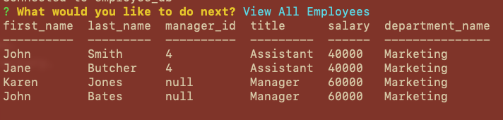

# TeamTrackr

[View a demo](https://drive.google.com/file/d/1FzgHvuFTfwajxl35WWCOzyjw6_IhypfU/view?usp=sharing)

## Description

TeamTrackr is a employee database app to keep track of employees, managers, job roles and company departments. With this app the user can view/update and add to the employee database quickly and easily through command prompt/terminal.

This app takes prompts from the user with inquirer and retrieves data using sql.

## Table of Contents
  [Description](#description)

  [Installation](#installation)

  [Technologies](#technologies)

  [Questions](#questions)
  
  [License](#license)

## Installation
This app can be cloned from this repo.

To install:
1. Navigate to directory using gitBash/terminal. 
2. Use command 'npm install' to install the required packages.
3. Use mysql to source the database schema from the ./db directory.
4. Run command npm start to start the app.

## Technologies
> SQL

> Inquirer

> Nodejs

## Questions

Created by RyanMcd29. If you have any questions about this project please contact me at ryan.mcdiarmid45@gmail.com.

## License

Licensed for use under MIT for more information please see license in repo.